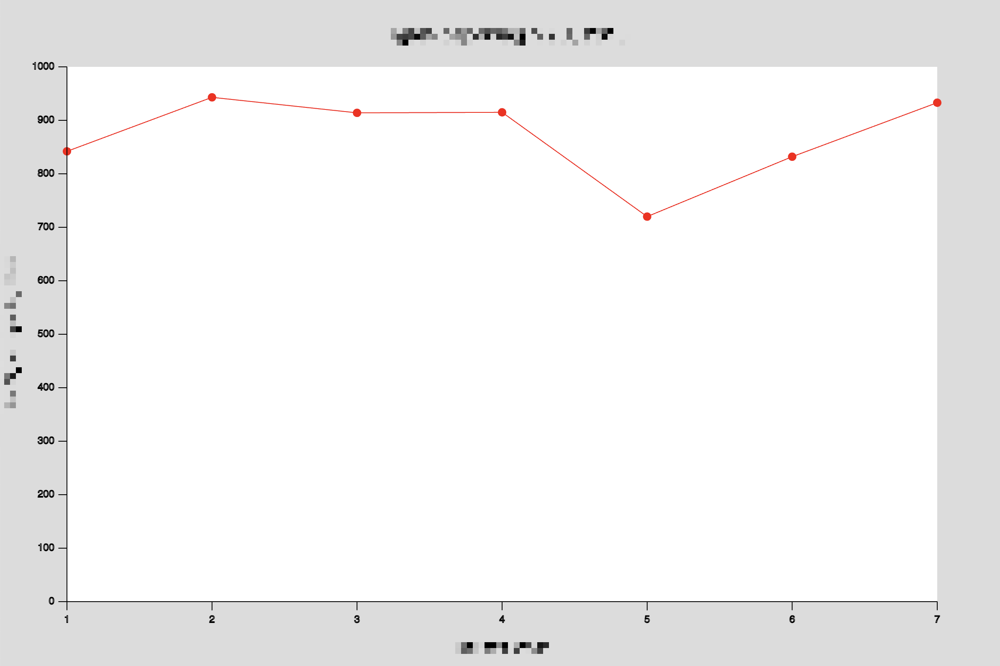

# Drawing Graphs with Code

In this exercise, you'll graph data using p5.js.

You are not going to use any graphing libraries. Just the kind of drawing tools you learned in year 1. but this is not graphing "by hand": you're going to use code and logic.

There are two phases of the worksheet. Each builds on the previous.

Open this directory in Visual Studio Code, and run [VS Code Live Server](https://marketplace.visualstudio.com/items?itemName=ritwickdey.LiveServer) to view your sketch; build upon the start in `sketch.js`.

## 1. Seven days of flight data

You're going to graph data about the number of flights leaving New York in 2013.

Here's the outline for your script, which you can find in `sketch.js`:

```js
let data;

function setup() {
  noLoop();
  createCanvas(800, 800);

  // # of flights leaving NYC airports
  // for the first seven days of 2013
  data = [842, 943, 914, 915, 720, 832, 933];
}

function draw() {
  background(220);
}
```

I'd like you to graph this data as a **line graph**.

A good graph has:

- a title
- labelled axes
- clear display of data

Write code to graph the contents of the `data` array.

> p5.js refresher! For plotting a series of points, you'll find `beginShape` / `endShape` functions useful, along with making several `vertex`es. You'll probably find yourself using `noFill` or `noStroke` a bit. And you'll definitely need `map` for thinking about scale.

Here's an ideal outcome:



(I'll let you work out what the labels could be)

When you've completed your seven day graph, [add it to this padlet](https://artslondon.padlet.org/tarmitage5/dvs-week-1-flight-data-graphs-klxgh47ikzz9h5v0)

---

## 2. Stretch Goal: A full year

The full dataset is for more than seven days; it covers the whole of 2013. Fortunately, it's already available: it is contained in the file `ypd.csv` in this directory.

Above your `setup` function, instantiate a variable `table` and add this `preload` function:

```js
let table;

function preload() {
  table = loadTable("ypd.csv", "csv");
}

function setup() {
  // ... etc
```

Inside your setup function, replace `data = [...]` with:

```js
data = table.rows.map((r) => r.getNum("count"));
```

Your `data` object is now all 365 days of data.

> Question: can you describe why that is - what's going on in the code I added?

What does your graph look like now?

Some questions to ask yourself:

- Does ths visualisation still function? If not, why not? Had you assumed things based on the initial data set?
- If it works, does it work well? Are there changes you need to make based on the new data?
- Does the new data highlight any failings in the visualisation?

Finally: does the new data reveal anything interesting - and if so, can you think about explanations for what you're seeing?

---

## Why are we doing this? / Learning Outcomes

Making a graph in code by hand reveals some key ideas about data visualisation:

- data **processing**: we may have data in a CSV file, but we still need to work out what it means, and which pieces we need
- **scaling and transforming** data: converting from the _domain_ of the data to the _range_ of a visual co-ordinate system is a _huge_ part of all visualisation work, and we're going to be doing something like this in any data work we do. Also, _choosing an appropriate scale_. Any visualisation is going to require consistent transformation
- **systematising** the process of doing this: building **a machine that makes graphs**, rather than a hand-written graph.

It also reveals some challenges of visualiastion - building sensible scales that adjust to data, handling things that aren't numbers (dates, text).

In future weeks, we're going to go into more detail regarding each of these aspects, and start leaning on tools to do these jobs for us - and to make them easier. But first, we need to know _why_ they are difficult.
